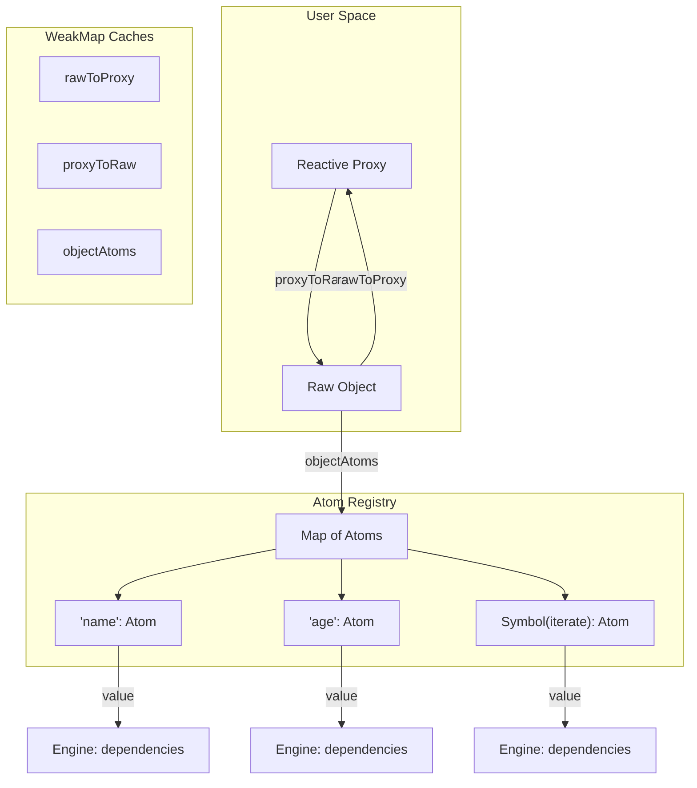

# Architecture of Deep Reactivity in @supercat1337/store2-deep

This document explains the internal design and implementation of the deep reactivity system in `@supercat1337/store2-deep`. It covers the core data structures, Proxy handlers, atom management, array handling, batching, and the `onChange` mechanism.

---

## Table of Contents

1. [High‑Level Concept](#1-highlevel-concept)
    - [1.1. Component Diagram](#11-component-diagram)
2. [Core Data Structures (Caches)](#2-core-data-structures-caches)
3. [Proxy Handler](#3-proxy-handler)
    - [3.1. `get` Trap](#31-get-trap)
    - [3.2. `set` Trap](#32-set-trap)
    - [3.3. `deleteProperty` Trap](#33-deleteproperty-trap)
    - [3.4. `ownKeys` Trap](#34-ownkeys-trap)
    - [3.5. `has` Trap](#35-has-trap)
4. [Atom Registry and Dependency Tracking](#4-atom-registry-and-dependency-tracking)
5. [Array Handling](#5-array-handling)
    - [5.1. Intercepting Mutating Methods](#51-intercepting-mutating-methods)
    - [5.2. Order‑Changing Methods (sort, reverse)](#52-orderchanging-methods-sort-reverse)
    - [5.3. Length and Indices Updates](#53-length-and-indices-updates)
6. [Batching Updates with `batch()`](#6-batching-updates-with-batch)
7. [The `onChange` Callback](#7-the-onchange-callback)
8. [Utilities: `toRaw`, `markRaw`, `isDeepReactive`](#8-utilities-toraw-markraw-isdeepreactive)
    - [8.1. `toRaw`](#81-toraw)
    - [8.2. `markRaw`](#82-markraw)
    - [8.3. `isDeepReactive`](#83-isdeepreactive)
9. [Lifecycle and Cleanup](#9-lifecycle-and-cleanup)
10. [Performance Considerations](#10-performance-considerations)
11. [Summary](#11-summary)

---

## 1. High‑Level Concept

`@supercat1337/store2-deep` provides **deep reactivity** for plain objects and arrays. Every property of a deeply reactive object is backed by its own **`Atom`** from the core `store2` library. This enables **granular updates**: only the properties that are actually read inside an `autorun` or `computed` will trigger recomputation when they change.

The system uses **lazy atom creation**: atoms are created on first property access, not upfront, to keep memory usage low.

The main components are:

- **Proxy** – intercepts operations on the reactive object.
- **WeakMap caches** – map raw objects to proxies and vice versa, and store per‑property atoms.
- **Handler** – implements the Proxy traps (`get`, `set`, `deleteProperty`, `ownKeys`, `has`).
- **Atoms** – created from `store2`’s `atom()` function, each storing a single value and managing dependencies.
- **Engine** – the core reactivity engine from `store2` that tracks dependents and propagates updates.

### 1.1. Component Diagram



---

## 2. Core Data Structures (Caches)

Three `WeakMap` caches are used to keep track of relationships and atoms:

| Cache         | Key → Value                            | Purpose                                                                                  |
| ------------- | -------------------------------------- | ---------------------------------------------------------------------------------------- |
| `rawToProxy`  | raw object → reactive proxy            | Return the same proxy when a raw object is encountered again (avoid duplicate proxies).  |
| `proxyToRaw`  | reactive proxy → raw object            | Retrieve the original raw object for `toRaw()`.                                          |
| `objectAtoms` | raw object → `Map(propertyKey → Atom)` | Store atoms for all properties of a given raw object. Each property gets its own `Atom`. |

Additionally, a special **`ITERATE_KEY`** symbol is used as a property key to track changes in the set of keys (addition/removal) of an object.

---

## 3. Proxy Handler

The `Proxy` handler intercepts five fundamental operations. All traps are implemented in `src/handler.js`.

### 3.1. `get` Trap

**Purpose:** Track property access and return the value, optionally wrapping nested objects with proxies.

**Algorithm:**

1. If the property is `__v_raw`, return the raw object (internal use).
2. If the target is an array and the property is a mutating method name (e.g., `push`, `splice`), return a wrapped function (see [Array Handling](#5-array-handling)).
3. For any other property (including array indices and `length`):
    - Create an `Atom` for the property (if it doesn’t exist) via `getAtom(target, prop, true)`.
    - Access `atom.value` to trigger dependency tracking in `store2`’s `Engine`.
4. Retrieve the raw value via `Reflect.get(target, prop, receiver)`.
5. If the value is a plain object or array (and not marked raw), wrap it with a deep proxy using `createDeepProxy` and cache it.
6. Return the value (or its proxy).

This ensures that every read establishes a dependency, and nested objects become reactive on access.

### 3.2. `set` Trap

**Purpose:** Update the raw object, the corresponding `Atom`, notify subscribers, and optionally invoke `onChange`.

**Algorithm:**

1. Ignore symbol keys (they are not tracked).
2. Get the old value and compare with new value.
3. If values are equal, return `true` (no change).
4. Perform the assignment on the raw object via `Reflect.set`.
5. Get or create the atom for the property and set its value to the new value.
6. If `onChange` callback is provided, call it with `path`, `oldValue`, `newValue`, and `target`.
7. If the property is new (not previously in the object) and not `'length'`, trigger structure notification via `notifyIterate`.
8. Return the result.

### 3.3. `deleteProperty` Trap

**Purpose:** Remove the property from the raw object, destroy its atom, and notify structure change.

**Algorithm:**

1. Ignore symbol keys.
2. Check if the property exists and capture its old value.
3. Perform `Reflect.deleteProperty`.
4. If deletion was successful:
    - Remove the atom from `objectAtoms` and call `atom.destroy()` to clean up subscriptions.
    - Call `onChange` with `newValue = undefined`.
    - Notify structure change via `notifyIterate`.

### 3.4. `ownKeys` Trap

**Purpose:** Track iteration (e.g., `Object.keys()`, `for...in`) to detect when the set of keys changes.

**Algorithm:**

1. Get or create the iterate atom (using `ITERATE_KEY`) and access its value to establish dependency.
2. Return `Reflect.ownKeys(target)`.

This trap is called for various operations, including `Object.getOwnPropertySymbols` and `Object.assign`. Even though it may fire in contexts where iteration isn't directly used, tracking the iterate atom is harmless: if the current effect doesn't depend on iteration, the atom won't be tracked, and no extra updates will occur.

> **Note:** Dependency registration via `iterateAtom.value` only occurs when the `ownKeys` trap is invoked **inside an active tracking context** (e.g., within an `autorun` or `computed`). If called outside any effect, reading `atom.value` does not register any dependency, so no unnecessary subscriptions are created.

### 3.5. `has` Trap

**Purpose:** Track the `prop in obj` operator.

**Algorithm:**

1. Ignore symbol keys.
2. Get/create the atom for the property and access its value to track dependency.
3. Return `Reflect.has(target, prop)`.

---

## 4. Atom Registry and Dependency Tracking

Every property of a reactive object is associated with an `Atom` from `store2`. Atoms are created lazily on first access.

- Atoms store the property’s current value.
- Reading an atom’s `.value` inside an `autorun`/`computed` registers a dependency via the `Engine`.
- Writing to an atom’s `.value` triggers the `Engine` to notify all dependents (effects, computed values, subscribers).

The `objectAtoms` WeakMap stores a `Map` for each raw object, mapping property keys (strings or symbols) to `Atom` instances. This allows efficient lookup and cleanup.

---

## 5. Array Handling

Arrays require special handling because mutating methods (e.g., `push`, `pop`, `splice`) can change length, shift indices, and modify multiple elements at once.

### 5.1. Intercepting Mutating Methods

The `get` trap detects when a mutating method is called on an array. Instead of returning the native method directly, it returns a wrapped function that:

1. Saves the **pre‑mutation state** (`oldLength` and a shallow copy of `oldValues`).
2. Performs the native method on the raw array.
3. After the mutation, **batches** all atom updates inside a `batch()` call.

### 5.2. Order‑Changing Methods (sort, reverse)

For methods like `sort` and `reverse` that change element order without changing length, we force updates for **all indices**, even if the value at an index remains the same. This ensures that order changes are correctly propagated to subscribers that depend on specific indices.

### 5.3. Length and Indices Updates

After a mutating method:

- **For each index from 0 to `newLength - 1`**:
    - Retrieve or create the atom for that index.
    - Update its value.
    - Call `onChange` if provided (with old and new values).
- **If `newLength < oldLength`**:
    - For each removed index, destroy its atom and call `onChange` with `newValue = undefined`.
- **Update the `length` atom** with the new length and call `onChange` if changed.
- **Notify iteration** (`notifyIterate`) to trigger any effects that depend on the array’s structure.

All these operations are performed inside a single `batch()` call, ensuring subscribers are notified only once after the entire mutation.

---

## 6. Batching Updates with `batch()`

`store2` provides a `batch()` function that collects multiple changes and notifies subscribers only once at the end of the batch.

In `store2-deep`, we use `batch()` in two key places:

1. **Array mutating methods** – all atom updates resulting from a single array method are batched together.
2. **User‑land** – developers can explicitly wrap multiple mutations with `batch()` to avoid intermediate notifications.

This improves performance and ensures consistent state updates.

---

## 7. The `onChange` Callback

`deepReactive` accepts an optional `onChange` function in its options:

```js
deepReactive(target, {
  onChange: (path, oldValue, newValue, target) => { ... }
});
```

**When is it called?**

- On every `set` operation (including array index assignments and length changes).
- On every `deleteProperty` (with `newValue = undefined`).
- On every array mutation, for each affected index and for length.

**Parameters:**

- `path` – an array of strings representing the property path (e.g., `['user', 'profile', 'age']`).
- `oldValue` – the value before the change.
- `newValue` – the new value (or `undefined` for deletion).
- `target` – the raw object containing the property.

**Use cases:** logging, persistence, time‑travel debugging, integration with external systems.

---

## 8. Utilities: `toRaw`, `markRaw`, `isDeepReactive`

### 8.1. `toRaw`

Returns the original raw (unproxied) object. It recursively unwraps nested proxies, handling circular references safely.

**Implementation:**

- Uses the `proxyToRaw` cache to get the raw object.
- Recursively iterates over the raw object’s own keys.
- If a value is a deep reactive proxy, replaces it with its raw counterpart (mutating the raw object in place).
- Only modifies properties that are writable (has a setter or is writable) to avoid errors with read‑only properties.
- Uses `WeakSet` to track visited objects and break cycles.

### 8.2. `markRaw`

Marks an object so that `deepReactive` will never proxy it. This is useful for external library instances, DOM elements, or objects that should remain mutable but not reactive.

**Implementation:** Adds a hidden `__v_skip` property with value `true`.

### 8.3. `isDeepReactive`

Checks whether a given value is a deep reactive proxy by testing if `proxyToRaw` has it as a key.

---

## 9. Lifecycle and Cleanup

- Atoms are created lazily and remain as long as the raw object exists (referenced in `objectAtoms`).
- When a property is deleted, its atom is destroyed via `atom.destroy()`, which cleans up all subscriptions.
- When a `deepReactive` object is garbage‑collected, the WeakMap caches and atom maps are also garbage‑collected (no explicit cleanup required by the user).
- To stop an `autorun`/`reaction`, call the returned `stop()` function, which unsubscribes from all dependencies.

---

## 10. Performance Considerations

- **Lazy atom creation** – atoms are only created for properties that are actually accessed, minimising initial memory usage.
- **WeakMap caches** – allow fast lookups without preventing garbage collection.
- **Batching** – reduces the number of notifications for bulk changes.
- **Minimal Proxy overhead** – only plain objects and arrays are proxied; primitive values are not wrapped.

---

## 11. Summary

The deep reactivity system in `@supercat1337/store2-deep` is built on a **per‑property atom** architecture, using `Proxy` and `WeakMap` caches. It integrates seamlessly with `store2`’s core `Engine`, providing granular dependency tracking and batch updates. Special care is taken for arrays, order‑changing methods, and edge cases like cyclic references and read‑only properties.

This design ensures:

- **Predictable reactivity** – only the exact properties used in a computation trigger updates.
- **Performance** – minimal overhead and efficient batching.
- **Flexibility** – the `onChange` callback enables advanced use cases like persistence and debugging.

For more details, refer to the source code and the AI documentation (`AGENTS.md`).
